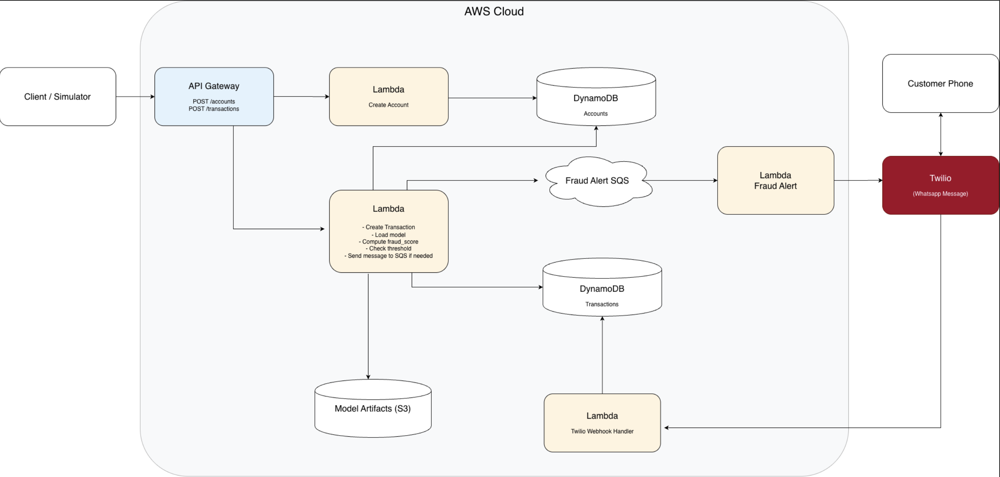

# Sentinel — Real-Time Fraud Detection System

**Capital One Capstone | University of Wisconsin-Madison | Spring 2026**

Sentinel is a real-time credit card fraud detection system. Transactions are scored the moment they come in using a machine learning model. If a transaction looks suspicious, the cardholder receives a WhatsApp alert via Twilio and can confirm or deny it with a simple YES/NO reply.

**Repository:** https://github.com/MihirSahu14/CapitalOneCapstone/tree/deploy/prod

**Live API:** https://api.freud.dpdns.org

**Interactive Docs:**
- https://api.freud.dpdns.org/accounts/docs
- https://api.freud.dpdns.org/transactions/docs

---

## Table of Contents

1. [Architecture Overview](#architecture-overview)
2. [How the Code Works](#how-the-code-works)
3. [Repository Structure](#repository-structure)
4. [Setup & Deployment](#setup--deployment)
5. [API Reference](#api-reference)
6. [What Works & What Doesn't](#what-works--what-doesnt)
7. [What We Would Work on Next](#what-we-would-work-on-next)

---

## Architecture Overview

Sentinel is fully serverless, deployed on AWS across two regions (us-east-2 primary, us-west-2 failover) for high availability.

```
Client / Simulator
        ↓
api.freud.dpdns.org  (Route 53 — DNS failover routing)
        ↓
API Gateway  (HTTP, custom domain with SSL via ACM)
        ↓
Lambda Functions (Python 3.12, FastAPI + Mangum)
        ↓
DynamoDB Global Tables  ←→  S3 (model artifacts)
        ↓ (if flagged)
SQS fraud-alert-queue
        ↓
fraud-alert-api Lambda → Twilio → Customer WhatsApp
        ↓ (customer replies)
Twilio Webhook → twilio-webhook-api Lambda → DynamoDB
```


### AWS Services Used

| Service | Purpose |
|---|---|
| **Lambda** | Runs all application code — serverless, scales automatically |
| **API Gateway** | HTTP routing, custom domain, SSL termination |
| **DynamoDB** | NoSQL database for accounts and transactions — Global Tables replicated across both regions |
| **SQS** | Decouples transaction scoring from fraud alerting — buffers flagged transactions |
| **S3** | Stores ML model artifacts — replicated across both regions |
| **Route 53** | DNS with failover routing — auto-switches to us-west-2 if us-east-2 health checks fail |
| **ACM** | SSL certificates for api.freud.dpdns.org |

### Regions

| Region | Role |
|---|---|
| us-east-2 (Ohio) | Primary |
| us-west-2 (Oregon) | Failover — Route 53 switches automatically if primary fails (~2.5 min) |

---

## How the Code Works

There are 4 Lambda functions, each a self-contained FastAPI application (adapted for Lambda via Mangum).

---

### 1. `accounts-api`

**Trigger:** API Gateway  
**Location:** `lambda/packages/accounts_lambda_package/src/`

Manages user accounts. An account stores the cardholder's phone number, home state, date of birth, and fraud sensitivity threshold.

`home_state` and `dob` are critical — they are looked up at transaction time to compute two key ML features: how far the transaction occurred from the user's home, and the user's age.

`threshold` (0.0–1.0) is the user's personal sensitivity setting. A score above this value triggers a WhatsApp alert.

**Validation on account creation:**
- `phone_number` — must be E.164 format (e.g. `+16085551234`)
- `home_state` — must be a valid 2-letter US state code
- `dob` — must be `YYYY-MM-DD` format
- Duplicate phone numbers are rejected with `409`

---

### 2. `transactions-api`

**Trigger:** API Gateway  
**Location:** `lambda/packages/transactions_lambda_package/src/`

The core of the system. When a transaction comes in, this Lambda:

**Step 1 — Account lookup**  
Queries DynamoDB by `phone_number` to retrieve `home_state`, `dob`, and `threshold`.

**Step 2 — Model loading (cold start only)**  
On the first invocation after a cold start, downloads `model.onnx` and `calibration_scores.npy` from S3 into `/tmp`. These are cached in memory via a global `_scorer_instance` for the lifetime of the container — subsequent warm invocations skip the download entirely.

**Step 3 — Feature engineering**  
The model requires 8 features. Two are computed at runtime:
- `distance` — haversine distance in km between the user's home state centroid and the merchant's state centroid (using a lookup table of US state geographic centers)
- `age` — computed from `dob` to current date

The remaining 6 come directly from the request: `amount`, `hour`, `day_of_week`, `merchant`, `category`, `state`.

**Step 4 — Scoring**  
The 8 features are fed into the XGBoost ONNX model. The raw fraud probability (e.g. `0.023`) is converted to a percentile score (e.g. `0.87`) using `calibration_scores.npy` — meaning this transaction looks more suspicious than 87% of all transactions ever seen. This makes the user's threshold meaningful.

**Step 5 — Save and queue**  
The transaction is saved to DynamoDB with `is_fraud=false` and `pending_confirm=0`. If `score >= threshold`, a message is sent to SQS and the Lambda returns immediately — it does not wait for the alert to be delivered.

---

### 3. `fraud-alert-api`

**Trigger:** SQS (`fraud-alert-queue`, batch size 1)  
**Location:** `lambda/packages/fraud_alert_lambda_package/src/`

Triggered asynchronously when a transaction is flagged. This Lambda:

1. Reads the transaction details from the SQS message body
2. Builds a formatted WhatsApp alert message with amount, merchant, state, and local time (timezone-aware per merchant state)
3. Sends the message via Twilio to the cardholder's WhatsApp
4. Marks `pending_confirm = 1` on the transaction in DynamoDB

If the Twilio call fails, the error is caught and logged — the message goes to `fraud-alert-dlq` after 1 attempt and does not retry. This prevents Twilio outages from spamming users with repeated alerts.

SQS configuration:
- Visibility timeout: 70 seconds (must exceed Lambda timeout of 60s)
- Max receives before DLQ: 1
- Batch size: 1

---

### 4. `twilio-webhook-api`

**Trigger:** API Gateway (Twilio sends a POST to `/twilio/webhook`)  
**Location:** `lambda/packages/twilio_webhook_lambda_package/src/`

When the cardholder replies to the WhatsApp message, Twilio forwards the reply to this Lambda.

1. Reads `From` (phone number) and `Body` (YES or NO) from the Twilio form payload
2. Looks up the account in DynamoDB by phone number
3. Finds the latest transaction with `pending_confirm = 1` for that account
4. YES → `is_fraud = false`, `pending_confirm = 0`
5. NO → `is_fraud = true`, `pending_confirm = 0`
6. Returns a TwiML XML response that Twilio sends back to the user ("Approved." or "Reported as fraud.")

If the reply is not YES or NO, a clarification message is sent back asking the user to try again.

---

### ML Model

**Algorithm:** XGBoost (gradient boosted decision trees)  
**Format:** ONNX Runtime (exported from scikit-learn pipeline)  
**Features:** 8 total — `amount`, `hour`, `day_of_week`, `distance`, `age` (numeric, StandardScaler) + `merchant`, `category`, `state` (categorical, OneHotEncoder)  
**Training goal:** Maximum recall — catching as many fraudulent transactions as possible  
**Test performance:** ROC AUC 0.9968, 95% recall at 0.5 threshold  
**Calibration:** Raw XGBoost probability → percentile score via `calibration_scores.npy`

---

## Repository Structure

```
lambda/
├── setup.sh                          # Install, zip, and deploy all Lambdas
├── packages/
│   ├── accounts_lambda_package/
│   │   ├── requirements.txt
│   │   └── src/
│   │       ├── app.py                # FastAPI app + Mangum handler
│   │       ├── config.py             # Environment variable settings
│   │       ├── db.py                 # DynamoDB access layer
│   │       └── routers/
│   │           └── accounts.py       # Account CRUD endpoints
│   ├── transactions_lambda_package/
│   │   ├── requirements.txt
│   │   └── src/
│   │       ├── app.py
│   │       ├── config.py
│   │       ├── db.py
│   │       ├── scorer.py             # Model loading, feature engineering, scoring
│   │       └── routers/
│   │           └── transactions.py   # Transaction scoring endpoint
│   ├── fraud_alert_lambda_package/
│   │   ├── requirements.txt
│   │   └── src/
│   │       ├── config.py
│   │       ├── db.py
│   │       └── handler.py            # SQS handler, Twilio WhatsApp sender
│   └── twilio_webhook_lambda_package/
│       ├── requirements.txt
│       └── src/
│           ├── app.py
│           ├── config.py
│           ├── db.py
│           └── routers/
│               └── webhook.py        # Twilio webhook handler (YES/NO processing)
└── zip/                              # Generated zip files (git-ignored)

Model/
├── train_xgb.py                      # XGBoost training script
├── export_onnx.py                    # Export trained model to ONNX format
├── test_onnx.py                      # Verify ONNX model outputs
├── tune_xgb_recall.py                # Hyperparameter tuning for recall
└── data/processed/                   # Training runs (git-ignored)
```

---

## Setup & Deployment

### Prerequisites

- Python 3.12
- pip
- AWS CLI (`brew install awscli`)
- Access to the AWS account (contact the team for IAM credentials)
- Twilio account with WhatsApp sandbox configured (for fraud alerts)

### 1. Clone the repository

```bash
git clone https://github.com/MihirSahu14/CapitalOneCapstone
cd CapitalOneCapstone
git checkout deploy/prod
```

### 2. Configure AWS CLI

```bash
aws configure
```

Enter when prompted:
```
AWS Access Key ID:     <your access key>
AWS Secret Access Key: <your secret key>
Default region name:   us-east-2
Default output format: json
```

You must have IAM permissions for Lambda, S3, DynamoDB, and SQS in the CapitalOneCapstone account.

### 3. Set up environment variables on each Lambda

Each Lambda reads its configuration from environment variables set in the AWS console (Lambda → function → Configuration → Environment variables). These are already configured on the live functions but must be set if deploying fresh:

**accounts-api (both regions)**
```
ACCOUNTS_TABLE=accounts
TRANSACTIONS_TABLE=transactions
```

**transactions-api**
```
ACCOUNTS_TABLE=accounts
TRANSACTIONS_TABLE=transactions
MODEL_S3_BUCKET=fraud-detection-model-1234          # us-east-2
MODEL_S3_BUCKET=fraud-detection-model-1234-west     # us-west-2
SQS_QUEUE_URL=https://sqs.us-east-2.amazonaws.com/600496202577/fraud-alert-queue   # us-east-2
SQS_QUEUE_URL=https://sqs.us-west-2.amazonaws.com/600496202577/fraud-alert-queue   # us-west-2
```

**fraud-alert-api (both regions)**
```
ACCOUNTS_TABLE=accounts
TRANSACTIONS_TABLE=transactions
TWILIO_ACCOUNT_SID=<your Twilio SID>
TWILIO_AUTH_TOKEN=<your Twilio token>
TWILIO_WHATSAPP_FROM=whatsapp:+14155238886
```

**twilio-webhook-api (both regions)**
```
ACCOUNTS_TABLE=accounts
TRANSACTIONS_TABLE=transactions
```

### 4. Upload the ML model to S3

The ML model files are not in the repository (too large). They must be uploaded to S3 manually before `transactions-api` will work.

Upload via AWS Console:
1. Go to S3 → `fraud-detection-model-1234`
2. Upload both files:
   - `model.onnx` — the trained XGBoost ONNX model
   - `calibration_scores.npy` — calibration scores for percentile conversion
3. Cross-region replication to `fraud-detection-model-1234-west` happens automatically

Or via CLI:
```bash
aws s3 cp model.onnx s3://fraud-detection-model-1234/model.onnx --region us-east-2
aws s3 cp calibration_scores.npy s3://fraud-detection-model-1234/calibration_scores.npy --region us-east-2
```

### 5. Install dependencies, zip, and deploy

Run the setup script from the `lambda/` directory:

```bash
cd lambda
chmod +x setup.sh
./setup.sh
```

This script does the following automatically:
1. Installs Linux-compatible dependencies for each package using pip's `--platform manylinux2014_x86_64` flag (required since Lambda runs on Linux, not Mac)
2. Handles `onnxruntime` separately — it requires a different platform tag (`manylinux_2_27_x86_64`)
3. Removes `boto3` and `botocore` from each package (AWS provides these in the Lambda runtime — bundling them wastes space)
4. Zips each package into `lambda/zip/`, excluding junk files (`.DS_Store`, `__pycache__`, `.pyc`, `.dist-info`)
5. Deploys each zip to both us-east-2 and us-west-2 using the AWS CLI

> **Note:** The first request to `transactions-api` after deployment will be slow (5–10 seconds) while it downloads the model from S3 into `/tmp`. Subsequent requests are fast.

### 6. Configure Twilio Webhook

In the Twilio console, set the WhatsApp sandbox incoming message webhook URL to:
```
https://api.freud.dpdns.org/twilio/webhook
```

This tells Twilio where to send cardholder replies (YES/NO).

---

## API Reference

**Base URL:** `https://api.freud.dpdns.org`

All requests and responses use JSON.

### Endpoints

| Method | Path | Description |
|---|---|---|
| `GET` | `/health` | Health check |
| `POST` | `/accounts` | Create account |
| `GET` | `/accounts/by-phone/{phone_number}` | Get account + transaction history |
| `PATCH` | `/accounts/by-phone/{phone_number}/threshold` | Update fraud threshold |
| `DELETE` | `/accounts/by-phone/{phone_number}` | Delete account |
| `POST` | `/transactions` | Submit a transaction for fraud scoring |
| `POST` | `/twilio/webhook` | Twilio webhook (internal — called by Twilio only) |

### Quick Examples

**Create account:**
```bash
curl -X POST https://api.freud.dpdns.org/accounts \
  -H "Content-Type: application/json" \
  -d '{"phone_number": "+16085551234", "home_state": "WI", "dob": "1998-01-07", "threshold": 0.8}'
```

**Submit transaction:**
```bash
curl -X POST https://api.freud.dpdns.org/transactions \
  -H "Content-Type: application/json" \
  -d '{"phone_number": "+16085551234", "amount": 500.00, "merchant": "Amazon", "category": "shopping", "state": "CA"}'
```

**Update threshold:**
```bash
curl -X PATCH "https://api.freud.dpdns.org/accounts/by-phone/%2B16085551234/threshold" \
  -H "Content-Type: application/json" \
  -d '{"threshold": 0.6}'
```

For full API documentation including all parameters and response schemas, see the interactive Swagger UI:
- https://api.freud.dpdns.org/accounts/docs
- https://api.freud.dpdns.org/transactions/docs

---

## What Works & What Doesn't

### What Works

- **Account management** — full CRUD with input validation (phone format, state code, DOB format, duplicate detection)
- **Real-time transaction scoring** — XGBoost ONNX model running in Lambda, scoring transactions in milliseconds on warm starts
- **Feature engineering** — distance computed from state centroids via haversine, age computed from DOB
- **Percentile calibration** — raw model probability converted to a 0–1 percentile score against the training distribution
- **Per-user threshold** — each account has its own sensitivity setting, adjustable anytime
- **WhatsApp alerting** — Twilio sends formatted alerts with amount, merchant, state, and timezone-aware timestamp
- **YES/NO confirmation loop** — cardholder replies update `is_fraud` and clear `pending_confirm` in DynamoDB
- **Multi-region deployment** — both us-east-2 and us-west-2 are live with Global DynamoDB Tables and S3 cross-region replication
- **Automatic failover** — Route 53 health checks switch traffic to us-west-2 if us-east-2 fails
- **DLQ protection** — failed Twilio alerts go to `fraud-alert-dlq` after 1 attempt, preventing retry storms

### What Doesn't Work / Known Limitations

- **CORS not configured** — API Gateway does not have CORS headers enabled. A browser-based frontend cannot call the API directly until this is set up (API Gateway → CORS → Allow-Origin: *, Methods: GET POST DELETE PATCH OPTIONS)
- **Cold start latency** — `transactions-api` takes 5–10 seconds on cold start to download the model from S3. Provisioned concurrency would fix this but costs money
- **Lambda concurrency cap** — currently limited to 10 concurrent executions across all functions. A concurrency increase request was submitted but pending AWS approval
- **No CloudWatch alarms** — there is no alerting if Lambda error rates spike or if the DLQ starts filling up
- **PITR not enabled** — DynamoDB point-in-time recovery is not turned on. If data is accidentally deleted, recovery is not possible
- **Twilio sandbox limitations** — using the Twilio WhatsApp sandbox, not a production number. Recipients must opt in by messaging the sandbox join code before they can receive alerts
- **No retraining pipeline** — the model is static. New confirmed fraud transactions from DynamoDB are not fed back into retraining automatically

---

## What We Would Work on Next

1. **CORS** — enable on API Gateway in both regions so a React frontend can call the API from the browser

2. **Automated retraining** — build a `retrain_from_dynamo.py` script that pulls confirmed transactions (where users replied YES/NO) from DynamoDB, combines them with the original training data, retrains the XGBoost model, exports to ONNX, and uploads to S3. Run this periodically on the training server (`mesh.local`) as the system accumulates real labeled data

3. **Provisioned concurrency** — pre-warm `transactions-api` containers so the model is always loaded. Eliminates cold start latency for production use

4. **CloudWatch alarms** — set up alerts for Lambda error rate, DLQ message depth, and API Gateway 5xx rate so the team is notified when things break

5. **PITR on DynamoDB** — enable point-in-time recovery on both the `accounts` and `transactions` tables

6. **Twilio production number** — move off the sandbox to a real Twilio WhatsApp number so users don't need to opt in manually

7. **React frontend** — a UI for cardholders to view transaction history, adjust their fraud sensitivity threshold, and see flagged transactions with their resolution status
