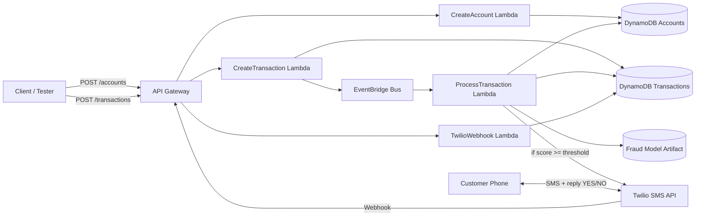

# Architecture Diagram

## Components

- API layer: account + transaction creation only (no direct fraud flag manipulation).
- Event-driven scoring: transaction processing is asynchronous.
- Fraud model:
  - Produces probability.
  - Transforms to percentile score for near-uniform `0-1` distribution.
- Alerting: Twilio sends texts when threshold is breached.
- Feedback loop: customer SMS reply updates transaction fraud flag.

## Why this matches requirements

- Better-than-random model performance: explicit train/test workflow and metrics.
- Uniform score distribution: percentile transform from historical score CDF.
- Configurable user thresholds: stored per account in DB.
- Notification + reply handling: Twilio outbound + webhook inbound flow.
- REST simulation API: dedicated endpoints for account and transactions.
